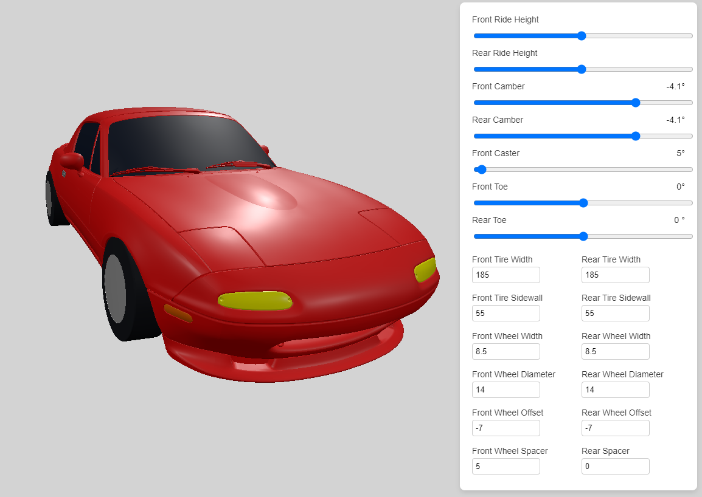

# Miata Fitment

A 3D wheel and tire fitment visualizer for the Mazda Miata. Pick a chassis, dial in wheel
size, offset, spacers, tire dimensions and alignment, and see the result on the car before
you buy anything.

Live at [miatafitment.com](https://miatafitment.com).

## What it does

- Three chassis to choose from: NA, NB and ND
- Wheel diameter, width, offset and spacer thickness, front and rear
- Tire width and sidewall, with rolling diameter worked out for you
- Camber, caster, toe and ride height, using measured Miata suspension geometry
- Spring rate and a bounce simulation to check clearance under compression
- Save setups to a garage, or share one with a link

## Contributing

I am not taking code contributions at the moment. If you hit a bug or have an idea, open an
[issue](https://github.com/aanthoonyy/MiataFitment/issues) and I will take a look.

## License

Copyright (C) 2026 aanthoonyy.

Licensed under the GNU General Public License v3.0. See [LICENSE.txt](LICENSE.txt).
